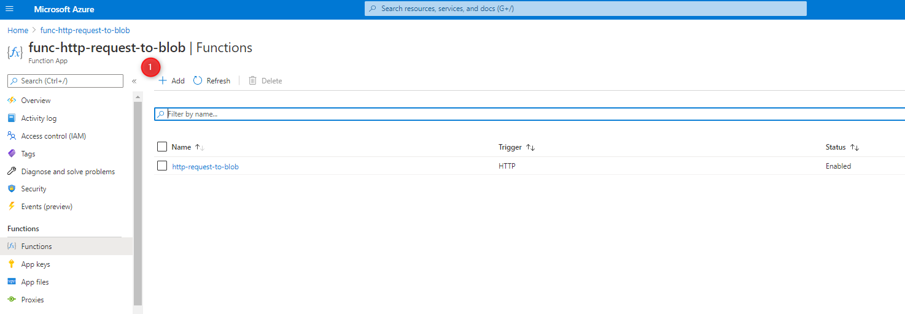
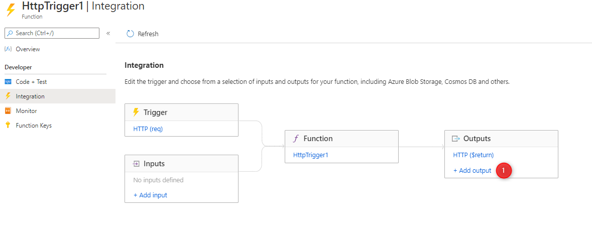
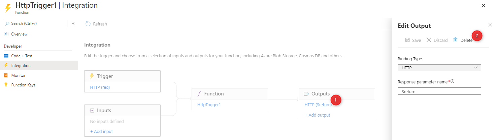
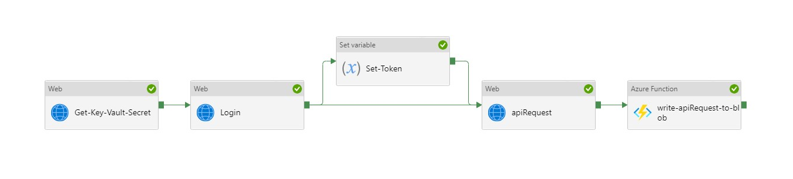
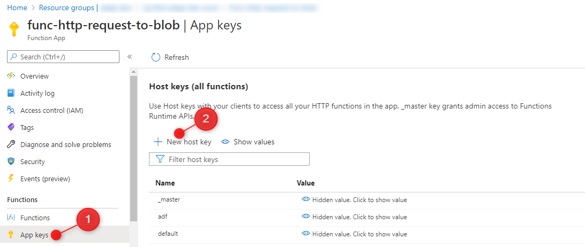
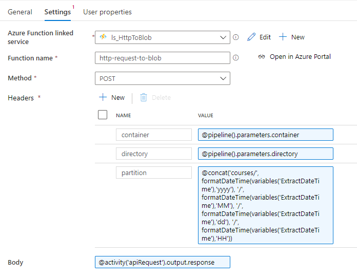

# func-http-request-to-blob

**Description**


This Azure Function App will take a HTTP response and write it to Blob storage.  This is useful in Data Factory when the API Service requires a session cookie for authentication.  Today, the cookie that is obtained in a login Web Activity cannot be added to the request in a Copy Data activity.  Use this approach to write data from a web call to an Azure Blob.


**Instructions**


***Function App***


1. Create Azure Function App

1. Create new Azure Function

   
   

1. Edit Function, navigate to **Integration**

1. Add Output: 

   
   - Binding Type: *Azure Blob Storage*

   - Blob parameter name: *outputBlob*

   - Path: *raw/httpRequests/{datetime:yyyy}/{datetime:MM}/{datetime:dd}/{datetime:HH}/{DateTime}-{rand-guid}.json*

   - Storage account connection: *AzureWebJobsStorage*

     
     

     
     

1. Delete Output: Click on the default output **HTTP ($return)** and choose delete

   
   

1. Edit Code: click on Code + Test

   
   ```c#:HttpRequestToBlob/run.csx
   #r "Newtonsoft.Json"
   #r "Microsoft.Azure.WebJobs.Extensions.Storage"
   
   using System.Net;
   using Microsoft.AspNetCore.Mvc;
   using Microsoft.Extensions.Primitives;
   using Newtonsoft.Json;
   using Microsoft.Azure.WebJobs.Extensions.Storage;
   
   public static async Task<IActionResult> Run(
       HttpRequest req,
       ILogger log,
       TextWriter outputBlob,
       Binder binder
   )
   {
       try {
           log.LogInformation("C# HTTP trigger function processed a request.");
   
           //Set container and directory from the Request query
           string container = req.Query["container"];
           string directory = req.Query["directory"];
           string partition = req.Query["partition"];
           string filename = req.Query["filename"];
   
           //Set container and directory from the Headers
           string containerHeader = req.Headers["container"];
           string directoryHeader = req.Headers["directory"];
           string partitionHeader = req.Headers["partition"];
           string partitionFilename = req.Headers["filename"];
   
           //Read the request body - this should contain what we want to write to Blob
           string requestBody = await new StreamReader(req.Body).ReadToEndAsync();
           dynamic body = JsonConvert.DeserializeObject(requestBody);
           
           //If query parameter values don't exist, then see if they are in the body, then in the header, and finally default.
           container = container ?? body?.container ?? containerHeader ?? "raw";
           directory = directory ?? body?.directory ?? directoryHeader ?? "httpRequests";
           partition = partition ?? body?.partition ?? partitionHeader ?? "httpRequest";
           filename = filename ?? body?.filename ?? partitionFilename ?? Guid.NewGuid().ToString();
           
           //Define the Blob location
           var blobName = $"{container}/{directory}/{partition}/{filename}.json";
           var storageAttribute = "AzureWebJobsStorage"; //Be sure that the Function App has this defined.
   
           //Create the attributes of the Blob
           var attributes = new Attribute[]
           {
               new BlobAttribute($"{blobName}"),
               new StorageAccountAttribute(storageAttribute)
           };
   
           //Write to the Blob, using attributes as defined above
           using (var writer = await binder.BindAsync<TextWriter>(attributes))
           {
               writer.Write(requestBody);
           }
   
           //Create OK results to send back to the requester (Data Factory)
           string result = $"{{'result': 'ok', 'status': 200, 'blobName': '{blobName}'}}";
           dynamic data = JsonConvert.DeserializeObject(result);
   
           //Send results back to the requester (Data Factory)
           return new OkObjectResult(data);
       }
       catch (Exception ex)
       {
           log.LogInformation($"Caught exception: {ex.Message}");
   
           string result = $"{{'result': 'bad', 'status': 400, 'Error': '{ex.Message.Replace("'", "\"")}'}}";
           dynamic data = JsonConvert.DeserializeObject(result);
           return new BadRequestObjectResult(data);
       }
   }
   
   ```

***Data Factory***


1. Create Data Factory Pipeline that has the login call, as well as a web activity that will return your desired data

   
   

1. Link the web activity to an Azure Function activity

1. Setup Linked Service for your Azure Function.  Take Key and URL from the Azure Function portal page

   - URL: Navigate to the `Overview` of the function app.  The URL will appear in the top right of the primary plane.

   - Keys: Navigate to the `App keys` of the funciton app.  Choose `+ New host key` and name it adf (for Azure Data Factory).  Choose `OK` and then save that key into your Key Vault or copy it for use in your linked service.

1. Setup Activity

   
   - Method: *Post*

   - Add Headers:

     
     - container - container in Azure Data Lake storage account that you want to land the data in

     - directory - the directory in the above container

     - partition - how you want the data partitioned.  I like to partition by date

       
       `@concat('subjectArea/', formatDateTime(variables('ExtractDateTime'),'yyyy'), '/', formatDateTime(variables('ExtractDateTime'),'MM'), '/', formatDateTime(variables('ExtractDateTime'),'dd'), '/', formatDateTime(variables('ExtractDateTime'),'HH'))`

     - filename - what you want the filename as.  I like to have a guid in the name, and you can append the subject area: @concat(guid(), '-subjectArea')

   - Add Body - click on Dynamic Content and choose the previous activity and add *.response* to the end

     
     
